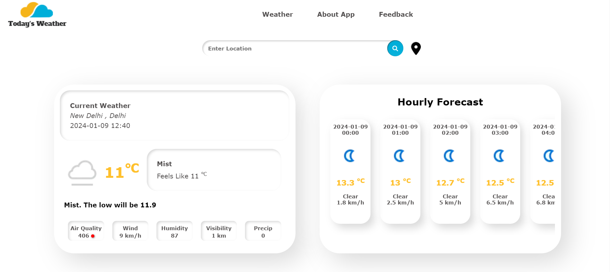

# WeatherApp

Live Demo: [Real Weather App](https://realweather.onrender.com)

# Images

 

# NodeJS Weather Web App

This NodeJS Weather Web App is a simple web application that allows users to check the current weather conditions for a specific location. It utilizes the OpenWeatherMap API to retrieve real-time weather data.

## Installation

Follow these steps to install and run the NodeJS Weather Web App:

1. **Clone the Repository:**

    ```bash
    git clone https://github.com/yourusername/nodejs-weather-app.git
    cd nodejs-weather-app
    ```

2. **Install Dependencies:**

    ```bash
    npm install
    ```

3. **Create Environment Variables:**

    - Create a new file named `.env` in the project root.
    - Add the following lines to the `.env` file, replacing `YOUR_API_KEY` with your actual [Weather API](https://www.weatherapi.com/) key:

        ```bash
        PORT=8000
        API_KEY=YOUR_API_KEY
        API_URL=https://api.weatherapi.com/v1/forecast.json
        S_URL=https://api.weatherapi.com/v1/search.json
        ```

## Usage

After running the application, open your web browser and navigate to [http://localhost:8000](http://localhost:8000) to access the NodeJS Weather Web App. You will be able to enter the city name and view the current weather conditions.

Feel free to explore and modify the application according to your needs. You can enhance it by adding more features or integrating additional APIs.

# License

This NodeJS Weather Web App is licensed under the MIT License. Feel free to use, modify, and distribute it as per the license terms.

## Author

- **Aniket Gupta**
  - GitHub: [@iamaniketgupta](https://github.com/iamaniketgupta)